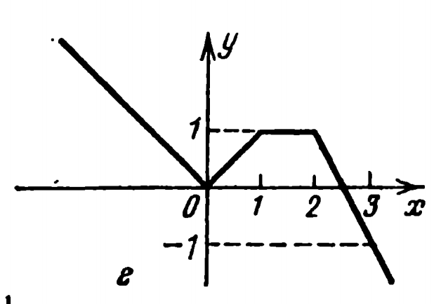
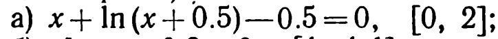
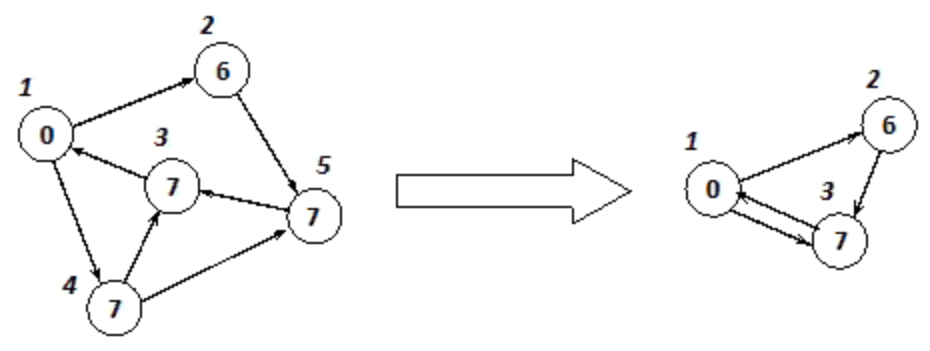
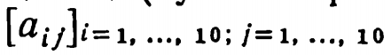
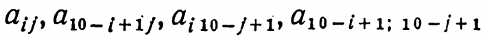

# PracticeTasks
 ## Оглавление:
1. [Задача 674 на ACMP](#Задание-1)
2. [Задача 602 на ACMP](#Задание-2)
3. [58, рисунок г (Из сборника задач по программированию)](#Задание-3)
4. [725(a)(Из сборника задач по программированию)](#Задание-4)
5. [399(Из сборника задач по программированию)](#Задание-5)
6. [Построить N элементов последовательности проверить, образуют ли элементы, стоящие на четных местах, возрастающую подпоследовательность](#Задание-6)
7. [Выписать все булевы функции от 3 аргументов, которые линейны. Выписать их вектора в лексикографическом порядке](#Задание-7)
8. [Граф задан матрицей инциденций. Выяснить, является ли он деревом](#Задание-8)
9. [Напишите рекурсивный метод создания циклического списка, в информационные поля элементов которого последовательно заносятся номера с 1 до N (N водится с клавиатуры)](#Задание-9)
10. [Написать метод «стягивания» в одну вершину всех вершин, информационное поле которых содержит заданное значение.](#Задание-10)
11. [Шифровка с помощью решетки](#Задание-11)
12. [Реализовать и сравнить сортировки 2 способов: блочную сортировку и сортировку простым выбором](#Задание-12)

## Задание 1:
### Задача:
 Точки на прямой
 На прямой отмечено N точек. Требуется найти такой отрезок длины L, на котором лежат M из отмеченных точек (M ≥ 2), что величина L/M минимальна. Считается, что точки, совпадающие с одним из концов отрезка, лежат на нем.

[:arrow_up:Оглавление](#Оглавление)

## Задание 2:
### Задача:
 Выбор приборов
 Для проведения эксперимента надо выбрать из N имеющихся приборов только три. Для этого выполняют следующую операцию - если в группе приборов больше трех, то их нумеруют и выбирают одну из групп: с четными или нечетными номерами. Операцию повторяют до тех пор, пока в группе не останется три или менее приборов. Если их остается ровно три, то они и берутся для эксперимента.

Требуется написать программу, которая подсчитает количество способов такого выбора приборов.
[:arrow_up:Оглавление](#Оглавление)

## Задание 3:
### Задача:
 Дано действительное число а. Для функции f (х), график которой представлен на рис. 1(г), вычислить f(а).
 
 [:arrow_up:Оглавление](#Оглавление)

## Задание 4:
### Задача:
 Дано действительное положительное число е. Методом деления отрезка пополам найти приближенное значение
корня уравнения f(x) = 0. Абсолютная погрешность найденного значения не должна превосходить е. (Ниже, рядом
с уравнением f(x) = 0, дополнительно указан отрезок, содержащий корень.)
 
 [:arrow_up:Оглавление](#Оглавление)
 
 ## Задание 5:
 ### Задача:
 Дана действительная квадратная матрица порядка 9. Получить целочисленную квадратную матрицу того же порядка, в которой элемент равен единице, если соответствующий ему элемент исходной матрицы больше элемента, расположенного в его строке на главной диагонали, и равен нулю в противном случае.
 [:arrow_up:Оглавление](#Оглавление)
 
  ## Задание 6:
  ### Задача:
 Ввести а1, а2, а3, N. Построить последовательность чисел ак = 13*а(к–1) – 10*а(к-2) + а(к–3). Построить N элементов последовательности проверить, образуют ли элементы, стоящие на четных местах, возрастающую подпоследовательность.
 [:arrow_up:Оглавление](#Оглавление)
 
  ## Задание 7:
  ### Задача:
  Выписать все булевы функции от 3 аргументов, которые линейны. Выписать их вектора в лексикографическом порядке.
 [:arrow_up:Оглавление](#Оглавление)
 
  ## Задание 8:
  ### Задача:
  Граф задан матрицей инциденций. Выяснить, является ли он деревом.
 [:arrow_up:Оглавление](#Оглавление)
 
  ## Задание 9:
  ### Задача:
 Напишите рекурсивный метод создания циклического списка, в информационные поля элементов которого последовательно заносятся номера с 1 до N (N водится с клавиатуры). Первый включенный в список элемент, имеющий номер 1, оказывается в голове списка (первым). Разработайте рекурсивные методы поиска и удаления элементов списка.
 [:arrow_up:Оглавление](#Оглавление)
 
  ## Задание 10:
  ### Задача:
 Написать метод «стягивания» в одну вершину всех вершин, информационное поле которых содержит заданное значение. При «стягивании» в графе остается только одна вершина, содержащая заданное значение, остальные вершины удаляются, но все исходящие из них и входящие в них дуги «передаются» оставшейся вершине. При этом петли, связывающие вершину с собой, не создаются. Не создаются также и параллельные дуги. Например, стянем вершины, содержащие значение 7.
 
 [:arrow_up:Оглавление](#Оглавление)
 
  ## Задание 11:
  ### Задача:
 Шифровка текста с помощью решетки заключается в следующем. Решетка, т. е. квадрат из клетчатой бумаги 10x 10 клеток, некоторые клетки в котором вырезаны, совмещается с целым квадратом 10x 10 клеток и через прорези на бумагу наносятся первые буквы текста. Затем решетка поворачивается на 90° и через прорези записываются следующие буквы. Это повторяется еще дважды. Таким образом, на бумагу наносится 100 букв текста. Решетку можно изображать квадратной матрицей порядка 10 из нулей и единиц (нуль изображает прорезь). Доказать, что матрица  может служить ключом шифра, если из элементов 
в точности один равен нулю.
Даны последовательность из 100 букв и матрица-ключ.
а) Зашифровать данную последовательность.
б) Расшифровать данную последовательность
 [:arrow_up:Оглавление](#Оглавление)

  ## Задание 12:
  ### Задача:
 Выполнить сравнение двух предложенных методов сортировки одномерных массивов, содержащих n элементов, по количеству пересылок и сравнений.
Для этого необходимо выполнить программную реализацию двух методов сортировки, включив в нее подсчет количества пересылок (т.е. перемещений элементов с одного места на другое) и сравнений.
Провести анализ методов сортировки для трех массивов: упорядоченного по возрастанию, упорядоченного по убыванию и неупорядоченного.
Все три массива следует отсортировать обоими методами сортировки.
Найти в литературе теоретические оценки сложности каждого из методов и сравнить их с оценками, полученными на практике.
Сделать выводы о том, насколько отличаются теоретические и практические оценки количества операций, объяснить почему это происходит. Сравнить оценки сложности двух алгоритмов.
- Блочная сортировка
- Сортировка простым выбором.
 [:arrow_up:Оглавление](#Оглавление)

